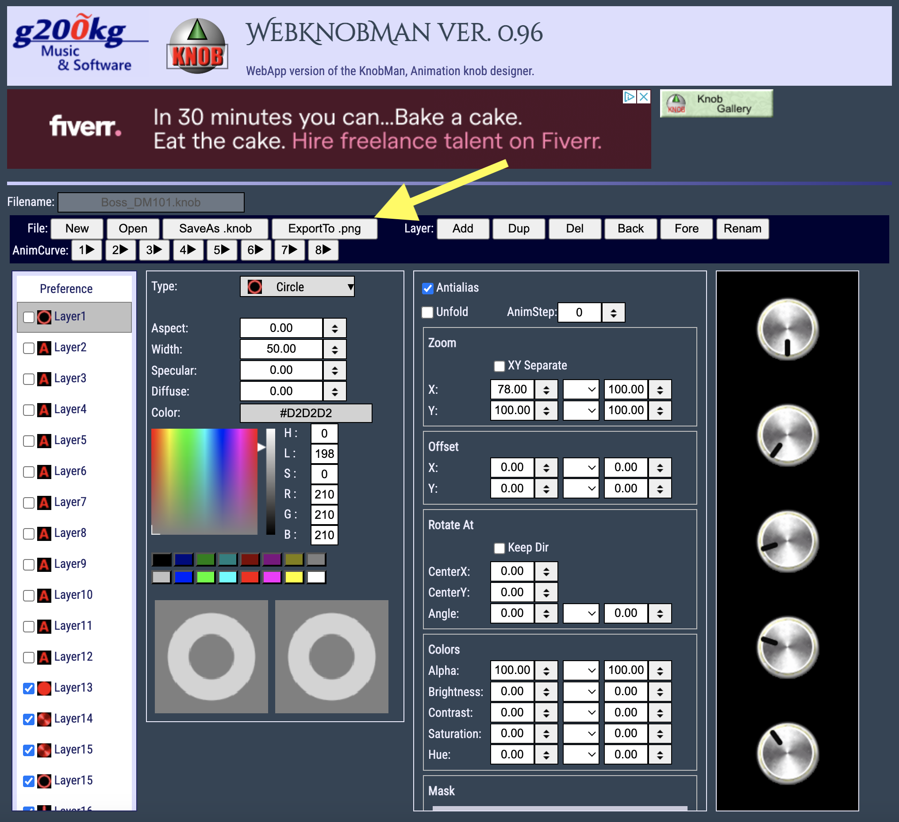

# Max-MSP-GUI-Tool-Online

An online tool for creating and customizing GUI elements for Max/MSP patches, inspired by the design philosophy of g200kg.com tools.

## Overview

This project aims to provide a web-based interface for designing and generating GUI components specifically tailored for Max/MSP environments. Similar to g200kg's KnobMan and SkinMan tools, this application allows users to create professional-looking interface elements without requiring advanced graphic design skills.

## Features

- Create custom knobs, sliders, buttons, and other GUI elements for Max/MSP
- Export designs in formats compatible with Max/MSP
- Save and share your custom GUI component libraries
- Real-time preview of components in a simulated Max/MSP environment
- Responsive design that works across devices

## Inspiration

This project draws inspiration from the excellent tools available at [g200kg.com](https://www.g200kg.com/), including:

- **KnobMan**: A specialized tool for creating knob graphics for virtual instruments and effects
- **SkinMan**: A graphic editor for designing UI components like buttons and sliders
- **WebModular**: An HTML5 and JavaScript-based modular synthesizer

## Development Status

This project is currently in early development. Contributors and testers are welcome!

## Getting Started

- [GALLERY](https://www.g200kg.com/en/webknobman/gallery.php) - A gallery of GUI designs created with this tool.

## Usage Instructions

### Opening Files for Modification
To open files for modification in the tool, follow the steps shown in the image below:

### Exporting to PNG Sequence for Max/MSP
After creating your GUI elements, you can export them as a PNG sequence to be imported into Max/MSP:

